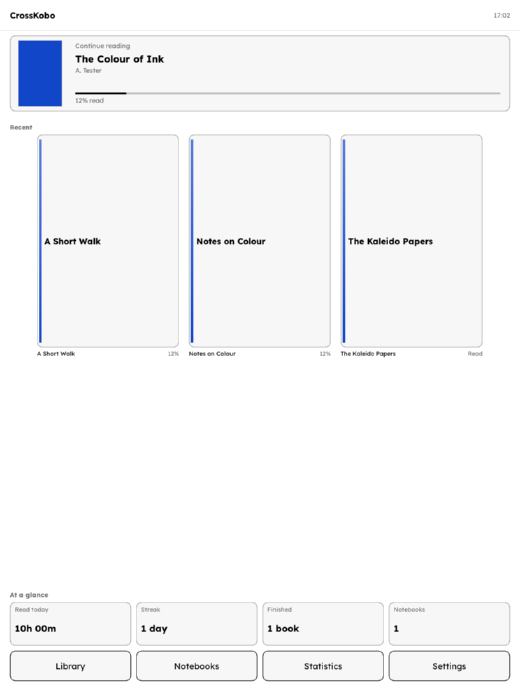

# CrossKobo

A replacement reading and note-taking interface for colour Kobo e-readers,
built around the **Kobo Libra Colour** and its Kaleido 3 colour panel.

CrossKobo boots instead of the stock Kobo software. It gives you a library,
an EPUB reader with proper typography controls, handwritten notebooks with
the Kobo Stylus 2, reading statistics, and colour that is actually used
rather than flattened to grey.

> **Status: version 0.2.0, running on a Kobo Libra Colour.**
> Two things here. **Catalogues** is its own small package: book catalogues
> (Shelfmark, Calibre-Web, Kavita, Komga, Gutenberg, a search-format server
> of your own) in the Kobo's own browser, from an entry in the stock menu -
> nothing runs at boot, and nothing of the CrossKobo interface is in it. See
> [docs/CATALOGUES.md](docs/CATALOGUES.md). The **full interface**, which
> starts in place of the stock software, is set aside for now: its touch
> handling has not held up on the device. Every release so far has been installed on real
> hardware and fixed what that turned up: the boot animation that repainted
> over the interface, a combined touch-and-stylus panel that broke taps, a
> transposed touch axis, sleep that woke straight back up, a blinking boot
> LED, and a handover to the stock software that undid itself. Read
> [docs/INSTALL.md](docs/INSTALL.md) before installing the full interface -
> holding a page-turn button while the device starts boots the stock
> software, and the installer is reversible.

## What it is, and what it is not

The request behind this project was "something like CrossInk, on my Libra
Colour". [CrossPoint Reader](https://github.com/crosspoint-reader/crosspoint-reader)
and its [CrossInk](https://github.com/uxjulia/crossink) fork are excellent
open-source firmware — for **XTEINK X3/X4 readers built on the ESP32-C3**.
That is a microcontroller with roughly 380 KB of usable RAM, a small
monochrome panel, a bitmap font engine and no operating system.

A Kobo Libra Colour is a different machine: a MediaTek MT8113 (dual
Cortex-A53), 1 GB of RAM, embedded Linux, and a 1264x1680 Kaleido 3 colour
panel driven through MediaTek's `hwtcon` display controller. CrossInk's
renderer is monochrome by design and its layout engine is built around
SD-card caching for a device with no memory; porting it would have meant
replacing the renderer, the font engine, the display layer and the build
system — which is to say, not a port at all.

So CrossKobo is an independent implementation for Kobo hardware that
follows CrossInk's feature set and user experience: the same settings
taxonomy, the same reading modes, the same statistics, the 3x3 recents
grid, the typography-first approach — with colour, TrueType fonts, and a
stylus. Credit for the design belongs upstream; the code here is new. Both
upstream projects are MIT licensed, as is this one.



More screens: [docs/SCREENSHOTS.md](docs/SCREENSHOTS.md).

## Features

- **Reader** — EPUB 2 and 3, plain text, CBZ. Justified text with
  hyphenation, real italics and bold, the book's own CSS (optionally
  ignored), images in full colour, footnote pop-ups, a table of contents,
  bookmarks, go-to-percent, and a reading position that survives everything.
- **Typography** — font family, size in points, line spacing, margins,
  alignment, paragraph indents and spacing, all adjustable while reading
  and applied without losing your place.
- **Colour** — a 32-bit colour pipeline end to end, with the Kaleido
  colour-filter-array modes exposed (standard, boosted, vivid, muted,
  greyscale) and an optional software saturation boost. Colour pages are
  refreshed with the panel's colour waveform, text pages with the fast one.
- **Notebooks** — pressure-sensitive handwriting with the stylus, ten ink
  colours, a highlighter, a stroke eraser, undo/redo, five page templates,
  many pages per notebook, and export to vector PDF or PNG. Ink is drawn
  straight to the panel with the A2 waveform so it appears under the nib.
- **Reading modes** — focus reading, guide dots, auto page turn from 5 to
  120 seconds, configurable tap zones, and page-turn button support.
- **Statistics** — books finished, total time, sessions, pages turned,
  average session, pages per minute, today, and a reading streak.
- **Shell** — home screen with continue-reading and a recents grid, three
  themes (Classic, Minimal, Dashboard), night mode, a library browser with
  search, front light and warmth control, sleep and power settings, and a
  touch/stylus calibration screen.

Full list: [docs/FEATURES.md](docs/FEATURES.md).

## Install

Two packages, from the
[latest release](https://github.com/Coral-coder/CrossKobo/releases/latest):

- **`Catalogues-<version>-install.zip`** - book catalogues in the Kobo's
  own browser: Shelfmark, Calibre-Web, Kavita, Komga, BookLore, Gutenberg,
  and a search-format server of your own, listed in a text file on the
  drive. The stock software stays exactly as it is;
  [NickelMenu](https://github.com/pgaskin/NickelMenu) is bundled and puts
  the entries in its menu. Nothing runs at boot. Firmware 4.x. Its own
  page: [docs/CATALOGUES.md](docs/CATALOGUES.md).
- **`CrossKobo-<version>-install.zip`** - the full interface, which starts
  instead of the stock Kobo home screen. Set aside for now.

Either one: unpack it to the root of the Kobo's USB drive and eject. The
device installs and restarts by itself. (Firmware 5.x devices want the
`-fw5-install` package for the full interface; *More → Settings → Device
information* on the Kobo tells you which you have.)

The full procedure, including how to get back to the stock software and
what to do if something goes wrong, is in [docs/INSTALL.md](docs/INSTALL.md).

## Supported devices

| Device | Codename | Panel | Status |
| --- | --- | --- | --- |
| Kobo Libra Colour | `monza` | Kaleido 3, 1264x1680 | primary target |
| Kobo Clara Colour | `spaColour` | Kaleido 3, 1072x1448 | should work |
| Kobo Clara BW | `spaBW` | 1072x1448 mono | should work |
| Kobo Elipsa 2E | `condor` | 1404x1872 mono | should work |
| Kobo Sage, Libra 2, Forma, Clara HD, … | various | mono | the i.MX code path exists but is untested |

"Should work" means the code detects the hardware and takes the right path,
not that anyone has run it there.

## Build

```sh
# host build, tests and the simulator
cmake -S . -B build -DCMAKE_BUILD_TYPE=Release
cmake --build build -j"$(nproc)"
ctest --test-dir build --output-on-failure

# device build: static armhf, then packaging
cmake -S . -B build-arm -DCMAKE_TOOLCHAIN_FILE=cmake/kobo-armhf.cmake
cmake --build build-arm -j"$(nproc)"
scripts/package.sh
```

The simulator runs the real application against an in-memory framebuffer
and writes every screen to a PNG, which is how the interface is reviewed
without a device:

```sh
./build/crosskobo-sim --out out/sim
```

More in [docs/DEVELOPMENT.md](docs/DEVELOPMENT.md), and the hardware notes
that this implementation is based on are in
[docs/HARDWARE.md](docs/HARDWARE.md).

## Credits

- [CrossPoint Reader](https://github.com/crosspoint-reader/crosspoint-reader)
  (Dave Allie) and [CrossInk](https://github.com/uxjulia/crossink) (uxjulia)
  for the design this follows.
- [FBInk](https://github.com/NiLuJe/FBInk) and
  [KOReader](https://github.com/koreader/koreader) for documenting the Kobo
  display controllers, input devices and boot process. No code is taken
  from either; the `hwtcon` ABI in `src/platform/eink_ioctl.h` comes from
  Kobo's published kernel sources.
- [KFMon](https://github.com/NiLuJe/kfmon) for establishing how a third
  party program can be started at boot on a Kobo, and reversed cleanly.
- Fonts: [Lexend Deca](https://github.com/googlefonts/lexend) and
  [Literata](https://github.com/googlefonts/literata), both SIL Open Font
  License.
- [stb](https://github.com/nothings/stb) (TrueType rasterising, image
  decoding) and [miniz](https://github.com/richgel999/miniz) (ZIP).

MIT licensed. See [LICENSE](LICENSE).
