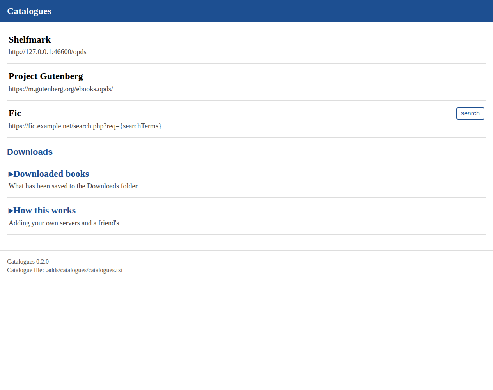
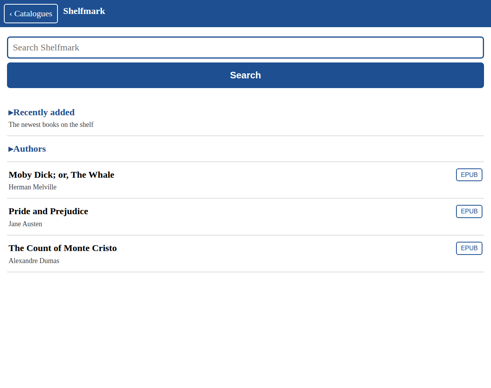
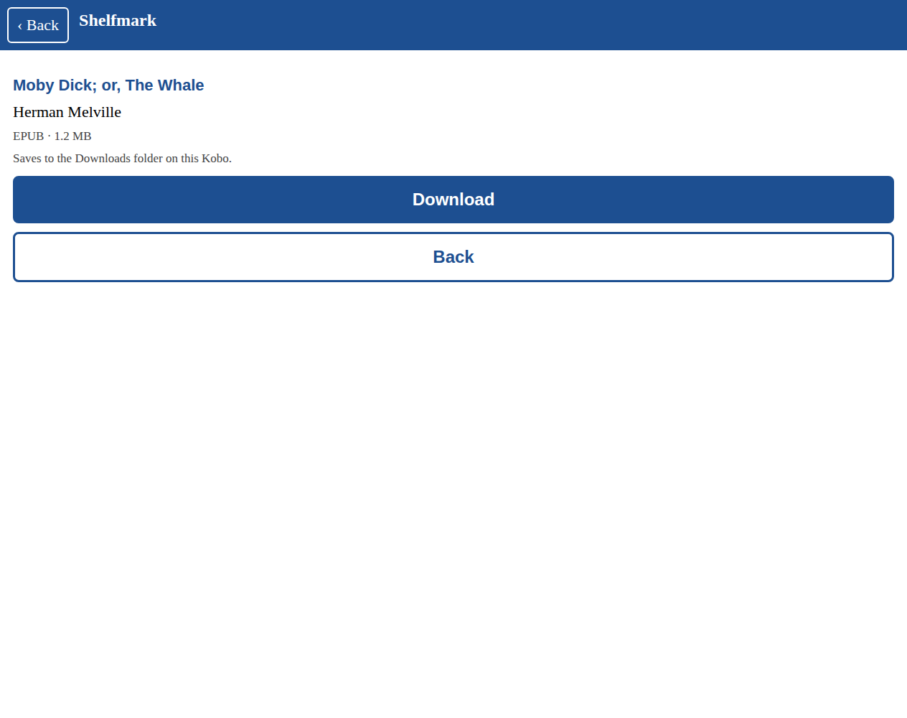
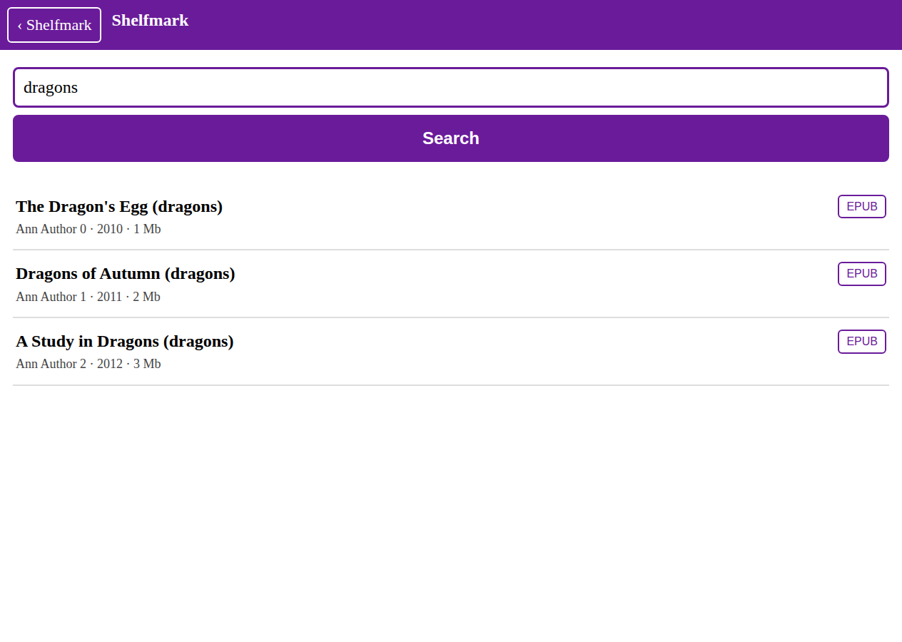

# Catalogues

Book catalogues in your Kobo's own browser. Shelfmark, Calibre-Web, Kavita,
Komga, BookLore, Project Gutenberg, the Internet Archive, and a
search-format server of your own - every one of them listed in a text file
on the drive, browsed and searched with the touch screen and keyboard the
Kobo already has, and downloaded straight onto the device.

The stock Kobo software stays exactly as it is. Catalogues is one small
program that serves web pages to the Kobo's browser; NickelMenu, which
comes in the package, puts the entries in the menu. Nothing runs at boot,
nothing touches the screen, and nothing of the CrossKobo interface is in
it.

*(Rendered at the Libra Colour's width in a desktop browser; the Kobo's
browser draws the same pages.)*

## Shelfmark — the search engine

Shelfmark is separate from Catalogues. It is not an OPDS browser: it is a
**search engine** with its **own sources file**, and its own menu entry. You
open it, you type, it searches every server you have listed at once, and
every result is one tap to download.

Its servers live in their own file — **never** `catalogues.txt`:

    .adds/catalogues/shelfmark.txt

One search server per line, hostnames not IP numbers:

    My server | https://fic.example.net/search.php?req={searchTerms}
    My server | https://fic.example.net/search.php?req={searchTerms} | user | password

A search-format server (`search.php` / `json.php`, the Library-Genesis
search shape a lot of self-hosted things speak) is searched in that format
and files come down by their id; an OPDS server that advertises a search
works too. No servers are shipped — the file starts empty with instructions,
and you add your own. Editing this file has nothing to do with your OPDS
catalogues, and vice-versa.

The **Shelfmark** menu entry opens it straight to the search box.

## Install

Firmware 4.x (every Libra Colour, Clara Colour, Clara BW, Libra 2, Sage,
Elipsa 2E and earlier device on the 4.x series).

1. Download `Catalogues-<version>-install.zip` from the
   [releases page](https://github.com/coral-coder/crosskobo/releases).
2. Plug the Kobo into a computer and **unzip it into the root of the
   drive** - not a subfolder. Afterwards the drive has `.kobo/KoboRoot.tgz`,
   `.adds/nm/catalogues`, `.adds/catalogues/catalogues.txt` and a
   `READ-ME-FIRST.txt` on it.
3. Eject safely and unplug. The device installs and restarts by itself.
4. On the home screen, open the **NickelMenu** tab at the bottom right and
   tap **Catalogues**.

That is the whole installation. If you already had NickelMenu, nothing
changes for it: the package carries the same release, and its own entries
stay as they were.

## Using it

The browser opens on a list of your catalogues. Tap one; tap folders to go
down and **Back** (top left) to come up; tap a book to see it, and tap
**Download**. The Kobo's own keyboard appears when you tap the search box.
Close the window with the X when you are done.

Downloads go into the **Downloads** folder on the drive. The Kobo adds them
to your library the next time it looks, which you can ask for with **Sync**
on the home screen or **Catalogues - add downloads to library** in the
menu.

**Shelfmark** in the menu opens the catalogue you have named Shelfmark in
the file, straight away. Until there is one, it says so and shows the list.

## Your servers

Everything on the first page comes from one file:

    .adds/catalogues/catalogues.txt

Plug the Kobo in and open it in any text editor. One server per line:

    Name | address
    Name | address | user | password
    Name | address | libgen

The page reads the file fresh every time it opens, so an edit over USB is
there on the next tap. A friend can send you a line to paste in.

Use a **hostname rather than an IP number**, and the same line works at
home and away, as long as the name resolves from wherever the Kobo is.

The kind of server is worked out from the address: `search.php` or
`json.php` means a search-format server, `{searchTerms}` a search
endpoint, anything else an OPDS feed. Add `libgen` or `opds` to the line if
the guess comes out wrong.

### Calibre-Web, Kavita, Komga, BookLore

All of these speak OPDS. Find the OPDS address in the server's settings and
add a line with it, plus a user and password if it asks for one:

    Calibre-Web | https://books.example.net/opds | me | secret

(Shelfmark is not here — it is a search engine, set up in its own file; see
the Shelfmark section above.)

### A search-format server

A server that answers `search.php?req=` or `json.php` the way forks of the
Library Genesis software do is searched in that format, and files are
fetched by their MD5 the way those servers do it. Give it the search
address:

    Fic | https://fic.example.net/search.php?req={searchTerms}

No addresses of that kind are shipped. The file lists what you put in it,
and the two public catalogues it starts with (Project Gutenberg and the
Internet Archive); delete those lines if you do not want them.

### https

The package carries its own fetcher - a statically linked `curl` with its
own TLS and its own resolver - and a current CA bundle, so `https`
addresses work the same on every device, whatever the firmware ships. A
server with a certificate of its own (a home CA) is trusted by putting the
certificate, in PEM form, at `.adds/catalogues/extra-ca.pem`. Verification
is never switched off.

## How it works

`/usr/local/catalogues/catalogues` is a web server bound to
`127.0.0.1:6420` - the device's own loopback address, unreachable from the
network. The menu entry runs `start.sh`, which starts it if it is not
already answering, asks the Kobo to connect to Wi-Fi the way it does for a
link, then opens the Kobo's browser on `http://127.0.0.1:6420/`. Nothing
in that chain waits for the connection, so the server does: a page that
needs a catalogue waits up to twenty seconds for the network to come up
before asking, and says "Wi-Fi is not connected" with a Try-again button
if it never does. The server exits after an hour without a
request and starts again on the next tap.

The pages are plain HTML: links, forms, one button. Nothing depends on a
script running, so every tap is handled by the browser itself. Feeds and
searches go through the same OPDS and search-format clients as CrossKobo;
downloads are written by the server into `Downloads`, never by the
browser.

The Kobo leaves its loopback interface unconfigured until Wi-Fi is turned
on, so the server gives `lo` its address and brings it up itself before
listening; the launcher does the same with `ifconfig`, in case.

The log is `.adds/catalogues/catalogues.log` on the drive. It is opened
and closed for every line, so the running server never holds a file open
on the drive - plugging the Kobo into a computer works with it running. If
a menu entry says the server did not start, the message shows the end of
this log.

## Remove

Unzip `Catalogues-<version>-uninstall.zip` onto the drive and eject; the
device restarts. Then open the NickelMenu tab and tap **Remove
Catalogues**. That takes away the program and its menu entries, and leaves
your books, the `Downloads` folder and the catalogue file alone.

NickelMenu stays. To remove it as well, put an empty file named
`uninstall` in `.adds/nm` on the drive and restart.

Nothing in either package runs at boot, so neither can leave the device
stuck on its boot screen.
