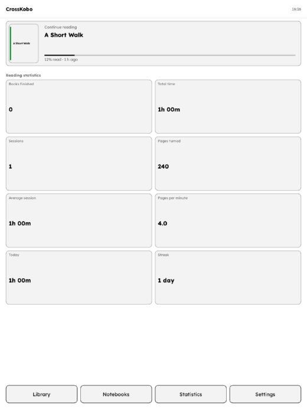
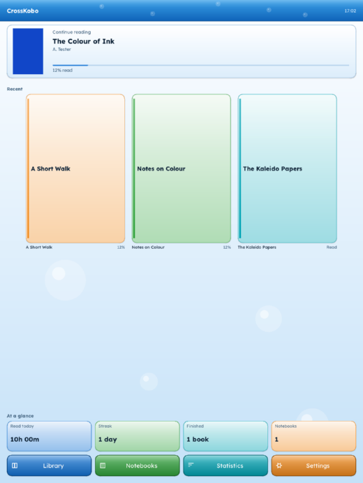
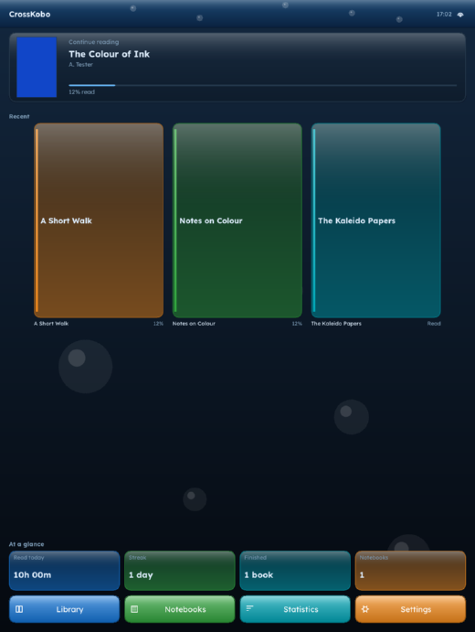
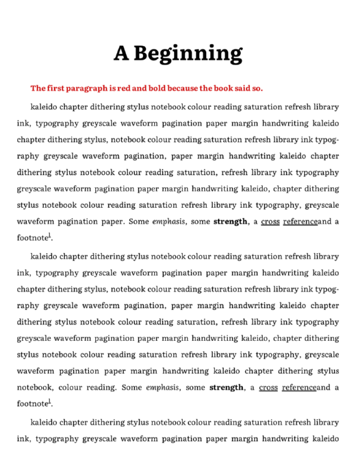
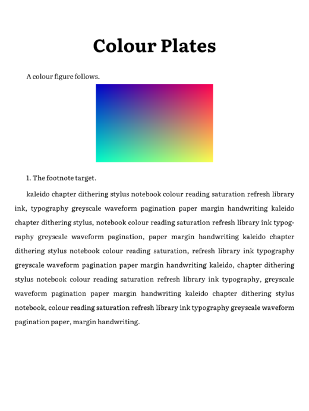
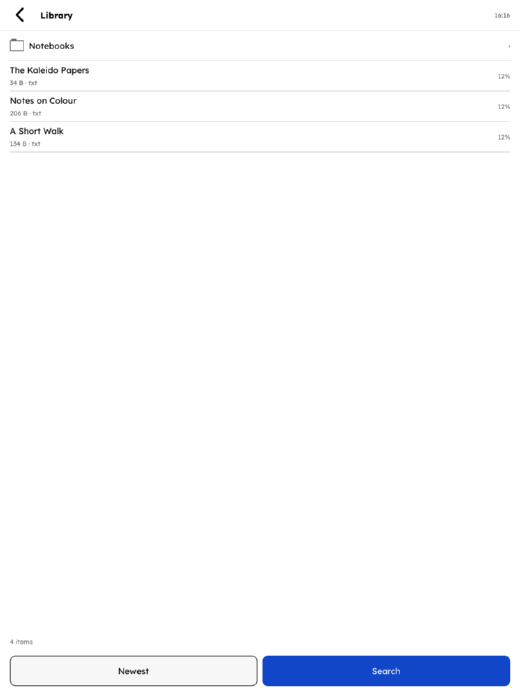
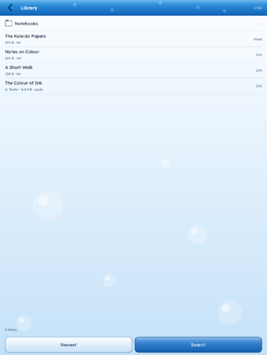
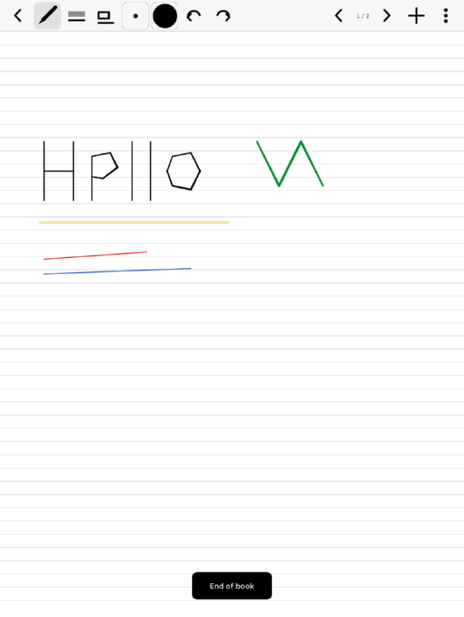
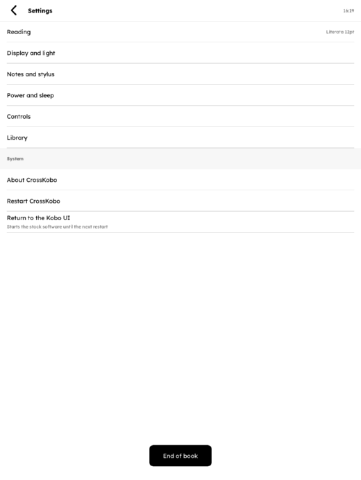
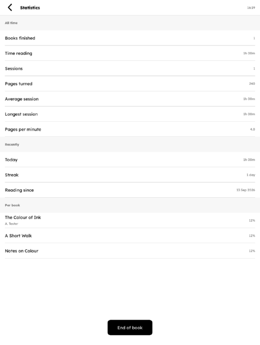

# Screens

These are rendered by the simulator at the Kobo Libra Colour's own
1264x1680, then scaled down for the page. Everything here is the real
application drawing into a real framebuffer — nothing is a mock-up.

Regenerate them with:

```sh
cmake --build build -j"$(nproc)"
./build/crosskobo-sim --out out/sim --doc-width 520
```

`--doc-width` also writes the scaled copies under `out/sim/doc` that this
page embeds.

## Home

The continue-reading card, the recents grid, and the way in to everything
else. Books with no cover art get a generated one.


The Dashboard theme swaps the grid for reading statistics.



The Aero theme: vertical gradients, a glass wash over the chrome, droplets
on the page ground, four-colour navigation, and a hue per coverless book.



Night mode has its own Aero palette - deep water rather than plain black,
with the tints washed toward the ground so they keep their contrast.



## Reading

Justified text with hyphenation, the book's own CSS (here a red bold
opening paragraph), real italics and bold, underlined links and a
superscript footnote marker.



Images keep their colour, and the page is refreshed with the panel's colour
waveform when there is colour on it.



## Library

Folders, formats, per-book progress, search and sort.



The same list under Aero.



## Notebooks

Pressure-tapered ink in several colours, a translucent highlighter, and a
lined template. The toolbar is pen, highlighter, eraser, width, colour,
undo, redo, then page navigation and the notebook menu.



## Settings and statistics




